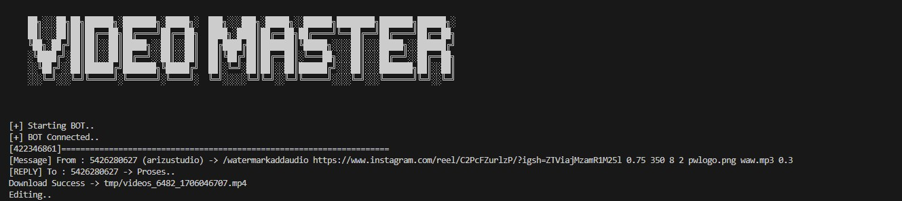
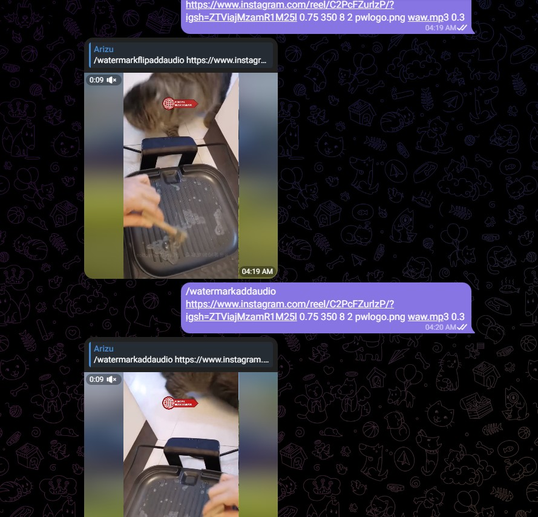

<h2 align="center">We present a tool with very useful functions to help your work</h2>
Video Master is a tool that helps you speed up the time for editing a video, generally if you edit a video from collecting materials or assets to the rendering stage it takes 5-10 minutes at the fastest. However, with this tool you only need 2-5 minutes (depending on your server specifications).


# Recommended Specifications
- 4 Core vCPU
- 8 GB RAM
# System Requirements
- Requires PHP7 or more<br/>
install in centOS / Almalinux
```
yum -y install php-cli php php-curl
```
install in Debian / Ubuntu
```
sudo apt install php-cli php php-curl
```
- FFMpeg binaries<br/>
If you want to use the auto matermark & flip mirror video feature, you need binaries from FFMpeg

# Install FFMpeg binaries in Linux
```
git clone https://git.ffmpeg.org/ffmpeg.git ffmpeg && cd ffmpeg
./configure
make
make install
```

# Install FFMpeg binaries in Windows
```
download https://www.gyan.dev/ffmpeg/builds/ffmpeg-git-essentials.7z
extract file & rename folder name
add to environment path -> YOUR_FFMPEG_FOLDER_LOCATION/bin/
```

# How to Install Video Master
```
git clone https://github.com/arizu-id/video-master.git videomaster && cd videomaster
php run.php
```

# Command List

```
/download [url]
/flip [url]
```
## Auto Editing With Watermark Module
```
/wm [url_video] [opacity] [size] [position_y] [position_x] [images]
/wma [url_video] [opacity] [size] [position_y] [position_x] [images] [audio] [volume]
/wma_border [url_video] [opacity] [size] [position_y] [position_x] [images] [audio] [volume] [borderColor] [borderSize]
/wm_ca [url_video] [opacity] [size] [position_y] [position_x] [images] [audio] [volume]
/wmf [url_video] [opacity] [size] [position_y] [position_x] [images]
/wmfa [url_video] [opacity] [size] [position_y] [position_x] [images] [audio] [volume]
/wmfa_border [url_video] [opacity] [size] [position_y] [position_x] [images] [audio] [volume] [borderColor] [borderSize]
/wmf_ca [url_video] [opacity] [size] [position_y] [position_x] [images] [audio] [volume]
```
#### Example
```
/wma https://www.instagram.com/reel/C2PcFZurlzP/?igsh=ZTViajMzamR1M25l 0.75 350 8 2 pwlogo.png waw.mp3 0.3
/wma_border https://www.instagram.com/reel/C2PcFZurlzP/?igsh=ZTViajMzamR1M25l 0.75 350 8 2 pwlogo.png waw.mp3 0.3 green 25
/wmf_ca https://www.instagram.com/p/CzBsd_btWAZ/ 0.4 250 2 2 pwlogo.png waw.mp3 0.75
```
## Preset mode to make shortcut commands
```
/preset [name] [INPUT_1] [INPUT_2] [INPUT_3] [INPUT_4]
/preset_sv [name] [command]
/preset_all
/preset_send [name]
/preset_del [name]
```
Add New Preset
```
/preset_sv testpreset /wma [INPUT_1] 0.75 350 8 2 pwlogo.png [INPUT_2] 0.3
```
Run Preset
```
/preset testpreset https://www.instagram.com/reel/C2PcFZurlzP/?igsh=ZTViajMzamR1M25l pwlogo.png waw.mp3
```
## Facebook APP Settings
```
/fbapp_detail
/fbapp_set [app_id] [app_secret]
```
## Facebook Page Settings
```
/fbapp_pageall
/fbapp_pageset [name] [token] [page_id]
/fbapp_pagedel [name]
```
## Auto Post
```
/p_fbpage [PageApp] [video] [caption]
```
## List Video Saved on Server
```
/storage
/storageclean
/storagesend [filename]
```
## List File Thumbnail on Server
```
/thumbnaildelete
/thumbnaillist
/thumbnailsave [url] [filename]
/thumbnailsend [filename]
```
## List File Audio on Server
```
/audiodelete [filename]
/audiolist
/audiosave [url] [filename]
/audiosend [filename]
/audioyt [url] [filename]
```
